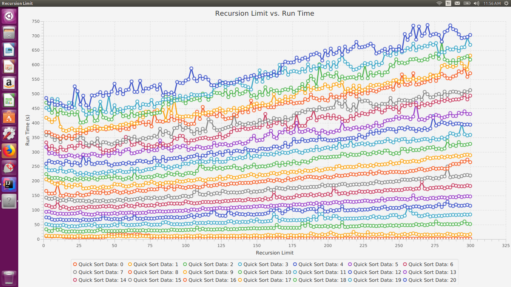
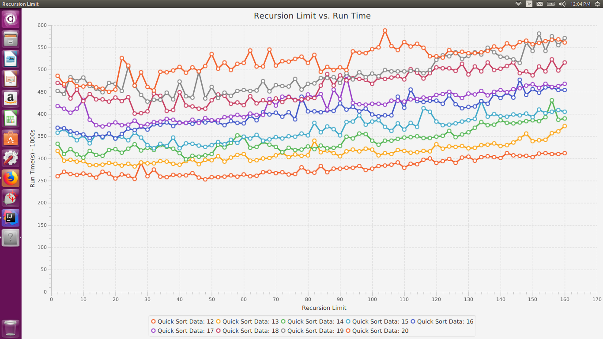

project folder:
Saytas-utilities-project08/

Brief description of submitted files:

In this project, we use a randomly selected array list of various sizes to investigate
the optimal recursion limit arrays of various sizes with the Quick Sort algorithm.

In the following graph with an array size is from 20,000 to 2,020,000 [Initial size + (Size * Recursion Limit)] (resources/run_1_plot_data.png), 
the run time with respect to the recursion limit is represented.
According to the graph, we can see countless distinctive behaviors in the run time, but the overall pattern
is the same. As the number of recursion limit increases, the run time also increases gradually. This is
due to the increasing array sizes that require more computation power compared to the smaller array sizes.
Whether a user has a faster CPU (Central Processing Unit) or not, this trend can be observed because of the nature of the QuickSort algorithm. Even though the QuickSort algorithm requires a small amount of memory
in order to perform sorting, its time complexity is O(nlogn) on average to do comparisons to sort n items; 
O(n^2) in the worst case scenario.

The following graph (resources/run_1_plot_data_zoom.png) is the zoomed in version of the previous graph with
an array size of 1,220,000 [Initial size + (Size * Recursion Limit)]. In this graph, I narrowed down the recursion limit approximately by half from 2 to 160, and we can see the running time of the last 9 trends in this graph. 
There are varied fluctuations can be viewed regardless of their array sizes. When we look at the "Quick Sort Data: 12" 
line, the recursion limit is at 2 and the running time is not it is lowest dealing with relatively small array size. 
Also, when we look at the "Quick Sort Data: 20" whose recursion limit is 106, its running time is all of its highest. 
Although the array size consistently increases, there is a relatively low running time that has not been overlooked.
I believe this trend is due to the fact that the implementation of InsertionSort algorithm that is used within the QuickSort algorithm. 
InsertionSort algorithm has O(n^2) on average and in the worst case, and its best case is O(n).

src/graphing_app

        - PlotGraphData2D.java
            - The PlotGraphData2D class plots the data that is read via GetGraphData class

        - PlotGraphData2D.java
            - The PlotGraphData2DZoom class plots the data that is read via GetGraphData
               class and zooms in within a certain range

src/utilities

        - FHsort.java
            - The FHsort class contains various sorting algorithms. Particularly, Quick Sort,
              divide and conquer, algorithm that recursively sorts the sub-lists of an array
              by choosing an element called pivot from the list then arranges the elements to
              the left that are less than the pivot and to the right that are greater than the
              pivot. This process is recursively applied to the sub-list of the elements with
              smaller and larger values

        - GetGraphData.java
            - The GetGraphData class reads the data from the CSV file

        - QuickSortTest.java
            - The QuickSortTest class investigates the recursion limit of arrays of various
              sizes. It investigates recursion limits from 2 to 300 by incrementing by 2 and
              runs them on different size arrays from 20.000 to a larger array size

resources/
    - 6 CSV files and 6 png files (Screenshot of the graphs)

        - RUN_1.csv
            - Recursion Limit: 2 - 300
            - Array Size: From 20.000 to 100.000 with 20 intervals

        - RUN_1_example_run.csv
            - Example run of QuickSortTest file

        - run_1_plot_data.png
            - The screenshot of RUN_1.csv graph

        - run_1_plot_data_zoom.png
            - The screenshot of RUN_1.csv graph zoomed in

        - RUN_2.csv
            - Recursion Limit: 2 - 300
            - Array Size: From 20.000 to 500.000 with 20 intervals

        - RUN_2_example_run.csv
            - Example run of QuickSortTest file

        - run_2_plot_data.png
            - The screenshot of RUN_2.csv graph

        - run_2_plot_data_zoom.png
            - The screenshot of RUN_2.csv graph zoomed in

        - RUN_3.csv
            - Recursion Limit: 2 - 300
            - Array Size: From 20.000 to 1.000.000 with 20 intervals

        - RUN_3_example_run.csv
            - Example run of QuickSortTest file

        - run_3_plot_data.png
            - The screenshot of RUN_3.csv graph

        - run_3_plot_data_zoom.png
            - The screenshot of RUN_3.csv graph zoomed in

    RUN.txt
        - Console output of QuickSortTest.java file

README.txt
- Description of submitted files